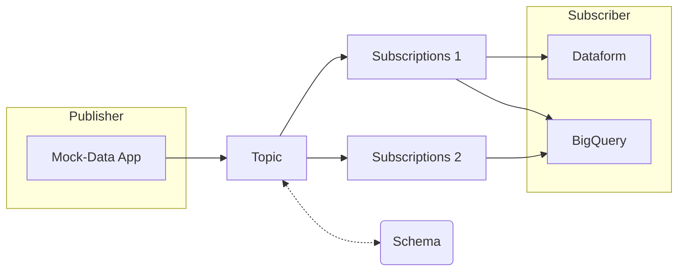

# Mock-Data for BigQuery 

#### Esta aplicação gera e dispara eventos com dados 'mockados' para seram usados na pipeline analítica BigQuery/Dataform

```mermaid
graph LR

    subgraph Publisher
        o1[Mock-Data App]
    end

    o2[Topic]
    o5[Subscriptions 1]
    o6[Subscriptions 2]
    o7(Schema)

    subgraph Subscriber
        o3[BigQuery]
        o4[Dataform]
    end

    o1 --> o2
    o2 --> o5
    o2 --> o6

    o5 --> o4
    o5 --> o3
    o6 --> o3
    o2 <-.-> o7
```

