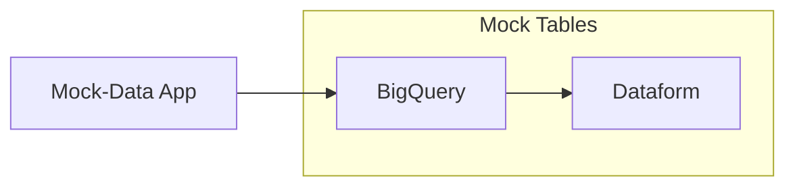

# Mock-Data for BigQuery 

 Esta aplicação gera e dispara eventos com dados 'mockados' para seram usados na pipeline analítica BigQuery/Dataform

 ****

### Arquitetura

****

### Funcionamento 

###### Mock-Data App:

Esta aplicação gera dados mockados para alimentar as tabelas já existentes, seguindo o mesmo `schema`. O dados são gerados a partir da biblioteca `Faker` que possui opções diversificadas para geração de dados conforme a necessidade da aplicação. 

