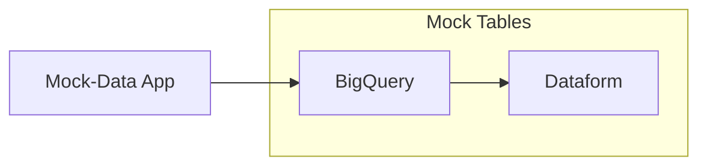

# Mock-Data for BigQuery 

 Esta aplicação gera e dispara eventos com dados 'mockados' para seram usados na pipeline analítica BigQuery/Dataform

 ****

### Arquitetura

****

### Funcionamento 

**Publicação:**

A aplicação Mock-Data gera dados e os envia para o `Tópico` existente. Esses dados podem ser de qualquer tipo, desde eventos simples até grandes volumes de dados estruturados.

**Distribuição:**

Quando uma nova mensagem é publicada no `Tópico`, o sistema de `Pub/Sub` a distribui para todos os `Subscribers` inscritos.

**Assinatura:**

O `Dataform` e o `BigQuery` se inscrevem no mesmo `Tópico`, indicando que vão receber as mensagens publicadas. Cada um pode ter suas próprias lógicas e regras de negócios para o processamento e filtros para os dados.

**Consumo:**

Cada `Subscriber` processa a mensagem de forma independente. O `Dataform` pode, por exemplo, armazenar os dados em um data warehouse, enquanto o `BigQuery` pode realizar análises complexas e criar views sobre os dados obtidos.
