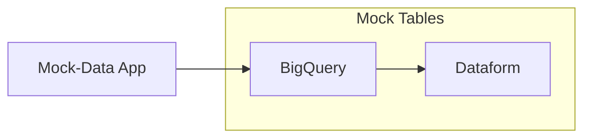
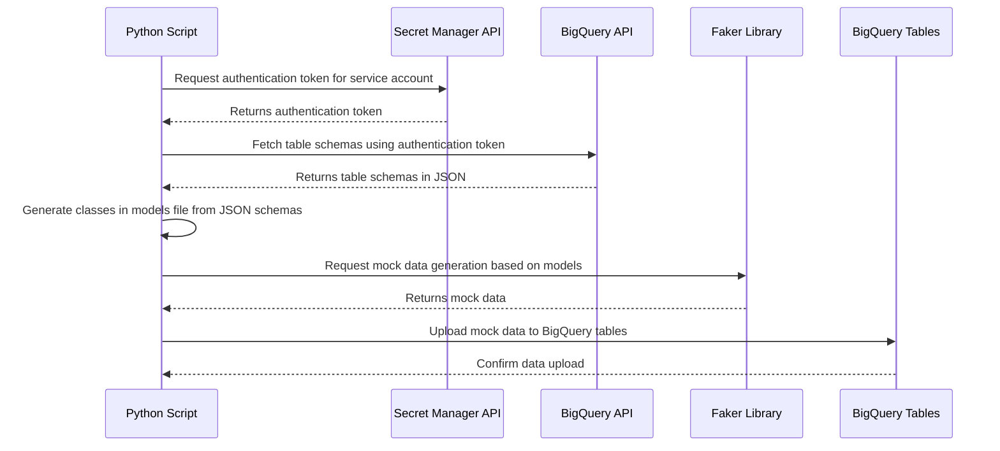

# Mock-Data for BigQuery 

[![BigQuery](https://img.shields.io/badge/BigQuery-1.7.0-color.svg?logo=data:image/svg%2bxml;base64,PHN2ZyBoZWlnaHQ9IjI1MDAiIHdpZHRoPSIyNTAwIiB4bWxucz0iaHR0cDovL3d3dy53My5vcmcvMjAwMC9zdmciIHZpZXdCb3g9Ii0xLjYzMzIzNTQzMzMyODI1NiA3LjAzMjYwOTMzMDMxNTY1NjUgMTMxLjI2NTc0NjgyNDE2ODc2IDExNC42MzQzOTA2Njk2ODQzNSI+PGxpbmVhckdyYWRpZW50IGlkPSJhIiBncmFkaWVudFVuaXRzPSJ1c2VyU3BhY2VPblVzZSIgeDE9IjY0IiB4Mj0iNjQiIHkxPSI3LjAzNCIgeTI9IjEyMC43ODkiPjxzdG9wIG9mZnNldD0iMCIgc3RvcC1jb2xvcj0iIzQzODdmZCIvPjxzdG9wIG9mZnNldD0iMSIgc3RvcC1jb2xvcj0iIzQ2ODNlYSIvPjwvbGluZWFyR3JhZGllbnQ+PHBhdGggZD0iTTI3Ljc5IDExNS4yMTdMMS41NCA2OS43NDlhMTEuNDk5IDExLjQ5OSAwIDAgMSAwLTExLjQ5OWwyNi4yNS00NS40NjdhMTEuNSAxMS41IDAgMCAxIDkuOTYtNS43NWg1Mi41YTExLjUgMTEuNSAwIDAgMSA5Ljk1OSA1Ljc1bDI2LjI1IDQ1LjQ2N2ExMS40OTkgMTEuNDk5IDAgMCAxIDAgMTEuNWwtMjYuMjUgNDUuNDY3YTExLjUgMTEuNSAwIDAgMS05Ljk1OSA1Ljc0OWgtNTIuNWExMS40OTkgMTEuNDk5IDAgMCAxLTkuOTYtNS43NXoiIGZpbGw9InVybCgjYSkiLz48cGF0aCBjbGlwLXBhdGg9InVybCgjYikiIGQ9Ik0xMTkuMjI5IDg2LjQ4TDgwLjYyNSA0Ny44NzQgNjQgNDMuNDI1bC0xNC45MzMgNS41NUw0My4zIDY0bDQuNjM3IDE2LjcyOSA0MC45MzggNDAuOTM4IDguNjg3LS4zODZ6IiBvcGFjaXR5PSIuMDciLz48ZyBmaWxsPSIjZmZmIj48cGF0aCBkPSJNNjQgNDAuODA0Yy0xMi44MSAwLTIzLjE5NSAxMC4zODUtMjMuMTk1IDIzLjE5NiAwIDEyLjgxIDEwLjM4NSAyMy4xOTUgMjMuMTk1IDIzLjE5NVM4Ny4xOTQgNzYuODEgODcuMTk0IDY0YzAtMTIuODExLTEwLjM4NS0yMy4xOTYtMjMuMTk0LTIzLjE5Nm0wIDQwLjc5NWMtOS43MiAwLTE3LjYtNy44OC0xNy42LTE3LjZTNTQuMjggNDYuNCA2NCA0Ni40IDgxLjYgNTQuMjggODEuNiA2NCA3My43MiA4MS42IDY0IDgxLjYiLz48cGF0aCBkPSJNNTIuOTkgNjMuMTA0djcuMjFhMTIuNzk0IDEyLjc5NCAwIDAgMCA0LjM4IDQuNDc1VjYzLjEwNHpNNjEuNjc1IDU3LjAyNnYxOS40MTFjLjc0NS4xMzcgMS41MDcuMjIgMi4yOS4yMi43MTQgMCAxLjQxLS4wNzUgMi4wOTMtLjE4OVY1Ny4wMjZ6TTcwLjc2NiA2Ni4xdjguNTYyYTEyLjc4NiAxMi43ODYgMCAwIDAgNC4zODItNC43di0zLjg2MXpNODAuNjkxIDc4LjI4N2wtMi40MDMgMi40MDVhMS4wODggMS4wODggMCAwIDAgMCAxLjUzN2w5LjExNSA5LjExMmExLjA4OCAxLjA4OCAwIDAgMCAxLjUzNyAwbDIuNDAzLTIuNDAyYTEuMDkyIDEuMDkyIDAgMCAwIDAtMS41MzZsLTkuMTE2LTkuMTE2YTEuMDkgMS4wOSAwIDAgMC0xLjUzNiAwIi8+PC9nPjwvc3ZnPg==)](https://cloud.google.com/bigquery/docs/reference/rest)

Esta aplicação gera e dispara eventos com dados 'mockados' para seram usados na pipeline analítica BigQuery/Dataform

****

### Arquitetura

****

### Funcionamento 

###### Mock-Data App:

Esta aplicação gera dados mockados para popular as tabelas já existentes, seguindo o mesmo `schema`. Os dados são gerados a partir da biblioteca `faker` que possui opções diversificadas para geração de dados conforme a necessidade da aplicação. 

****

### Requisitos e Configurações para rodar esta aplicação 

- Python versão 3.12.6 ou superior

- Autenticação com [`google.cloud.client`](#autenticação)

- Poetry versão 1.8.3 ou superior

****
### Fluxo de eventos:

**** 

