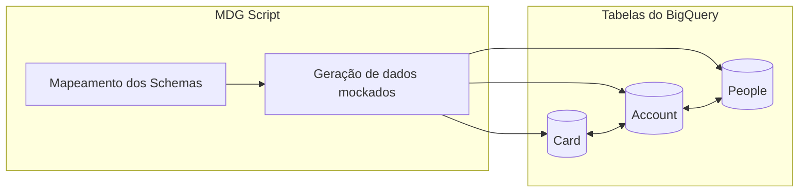

# **Mock Data Generator**

## Overview:

## Descrição:

Este script Python é responsável pela inserção de dados fictícios (mockados) em tabelas do BigQuery. Ele é projetado para auxiliar na validação de rotinas de dados, permitindo testar e verificar a integridade e o funcionamento das operações de manipulação de dados em um ambiente controlado. Ao gerar dados realistas, o script ajuda a simular cenários de uso e a identificar possíveis problemas nas rotinas de ETL (Extração, Transformação e Carga) e outras operações relacionadas a dados.

----

## Documentação:

1. [Padrões de Commits](docs/commit-patterns.md)  
2. [Gerenciamento de Branches](/docs/branch-management.md)
3. [Ferramentas e Dependências](/docs/tools-and-dependencies.md)
4. [Diagrama de Sequência](/docs/sequence-diagram.md)
5. Preparar o ambiente para rodar a aplicação:  
    1. [Ubuntu WSL Terminal (Recomendado)](/docs/application-environment/ubuntu.md)
    2. [Windows Terminal](/docs/application-environment/windows.md)
6. [Como Fazer a Autenticação](/docs/how-to-authenticate.md)