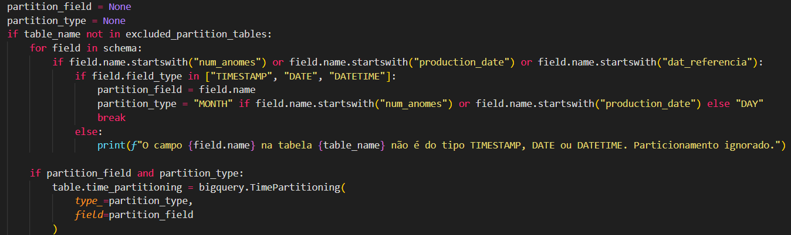

<div style="text-align: justify;">

# **Passos para gerar os dados mockados**

&nbsp;&nbsp;&nbsp;&nbsp;&nbsp;&nbsp;&nbsp;&nbsp;Explicação do Diretório
Dentro de "src" há as pastas e arquivos que estão organizadas de acordo com a aplicação.  
## Pastas
* **"bq_schemas"** contém os datasets que estão divididos em pastas e dentro delas as respectivas tabelas.
* **"py_models"** contém as classes que representam os dados separadas por datasets.
* **"py_schemas"** contém os schemas do tipo schemafield para a criação das tabelas no Big Query separadas por datasets.

## Arquivos Python
* **"main.py"** é o arquivo principal da aplicação.
* **"utils.py"** é o arquivo das funções principais.
* **"test_connection.py"** é o  arquivo de teste da conexão com o Big Query.
* **"jsonl_format.py"** é  o arquivo que converte os dados em formato jsonl.

## Arquivos Python para o Gemini
* **"generate_models.py"** é  o arquivo que gera as classes apartir dos arquivos do bq_schemas.
* **"gemini_results.py"** é o  arquivo que gera os dados mockados apartir das classes geradas pelo Gemini.
* **"gemini_interface** é o arquivo que contém o funcionamento do Gemini
* **"gemini_datagen.py"** é o arquivo que comtém as funções feitas pelo Gemini que gerarão os dados mockados.

## Passo 1: Dependências
&nbsp;&nbsp;&nbsp;&nbsp;&nbsp;&nbsp;&nbsp;&nbsp;Instale as dependencias necessárias para que a aplicação ocorra corretamente antes de executar qualquer arquivo. Após a instalação das dependencias, terá que criar um arquivo .env na raiz do projeto, onde  irá inserir as credenciais do seu projeto no Google Cloud, seguindo o exemplo no arquivo `.env.example`, com o `PROJECT_ID e o SECRET_NAME`


## Passo 2: Autenticação com o Big Query
&nbsp;&nbsp;&nbsp;&nbsp;&nbsp;&nbsp;&nbsp;&nbsp;Precisa autenticar-se ao Big Query. Para isso escreva no terminal: 

```
gcloud auth application-default login
```

&nbsp;&nbsp;&nbsp;&nbsp;&nbsp;&nbsp;&nbsp;&nbsp;Execute, onde abrirá o navegador para que possa logar na sua conta do GCP.

## Passo 3: Schemas em JSON
&nbsp;&nbsp;&nbsp;&nbsp;&nbsp;&nbsp;&nbsp;&nbsp;Precisará de um arquivo JSON com os schemas de origem das tabelas que deseja-se criar no Big Query. Pois o código principal ele tenta imitar o diretório local da pasta `bq_schemas` no Big Query.

* **Criar novo Dataset:** Precisa criar uma nova pasta dentro de ""bq_schemas"" caso queira  criar um novo dataset.
* **Criar nova Tabela:** Precisa criar uma nova tabela precisa de um arquivo JSON dentro da pasta do dataset.  
Como exemplo de JSON é só abriar uma das tabelas, como a bq_schemas/base_operacional/conta_cartão_cliente.json.

## Passo 4: Schemas JSON para Schemas Pydantic e SchemasFields
&nbsp;&nbsp;&nbsp;&nbsp;&nbsp;&nbsp;&nbsp;&nbsp;A seguir execute o  arquivo `generate_models.py` para gerar as classes apartir dos arquivos do bq_schemas. Junto esse arquivo também  é gerado os schemas do tipo schemafield na pasta `py_schemas`.

## Passo 5: Subir as tabelas
 > ⚠️ **ATENÇÃO** Em caso de particionamento das tabelas, a função `create_tables()` contém uma classificação de particionamento por MONTHY e DAY. Esse contexto de particionamento o código procura a última coluna de cada tabela e analisa se precisa do particionamento ou não baseado no nome que está destacado no código. Se tiver mais algum parametro precisa ser adicionado direto no código.  



* **Tabela particionada:** Execute normalmente o "main.py"
* **Tabela não particionada:** Precisa adicionar o nome da tabela no array "excluded_partition_tables".


&nbsp;&nbsp;&nbsp;&nbsp;&nbsp;&nbsp;&nbsp;&nbsp;Proxímo passo é executar o arquivo `main.py` com a função create tables para subir os datasets e as tabelas no Big Query.

## Passo 6: Atualizações das tabelas
Caso precise atualizar o tipo da tabela ou adicionar uma descrição à coluna precisa modificar a coluna que queira dentro da pasta `py_models`.


Ex: Adição de descrição. 

Antes
```
bigquery.SchemaField('id_conta', 'INTEGER', 'NULLABLE'),
```
    
Depois
```
bigquery.SchemaField('id_conta', 'INTEGER', 'NULLABLE', description='ID único da conta do cartão.'),
```
 

## Passo 7: Geração de dados mockados
&nbsp;&nbsp;&nbsp;&nbsp;&nbsp;&nbsp;&nbsp;&nbsp;Para a geração de dados mockados precisa seguir a seguinte ordem.
* **Modificar o Gemini:** Entrar no arquivo `gemini_interface` e modificar a variavel prompt como se pede.
* **Modificar função Faker:"** Dentro do arquivo `jsonl_format.py`, ao final dele, contém o nome de funções Faker geradas no `gemini_results`. Quando o Gemini gerar a função para tabela que precise, import ela dentro  do arquivo `jsonl_format.py` e chame a função Faker que precisa.

```
75     create_jsonL(criar_Acordo_faker,NUM_LINES)
76     create_jsonL(criar_Cliente_faker,NUM_LINES)
```

* **Quantidade de dados:** E por último a mudança na váriavel "NUM_LINES" caso queira.


&nbsp;&nbsp;&nbsp;&nbsp;&nbsp;&nbsp;&nbsp;&nbsp;Ao final o código criará uma pasta chamada `jsonl_mock` e dentro dela o arquivo com os dados gerados prontos para serem enviados ao Big Query.


&nbsp;&nbsp;&nbsp;&nbsp;&nbsp;&nbsp;&nbsp;&nbsp;Após esses passos, execute o `main.py` com a função `jsonl_to_bigquery()`, onde enviará o dados para o Big Query

</div>