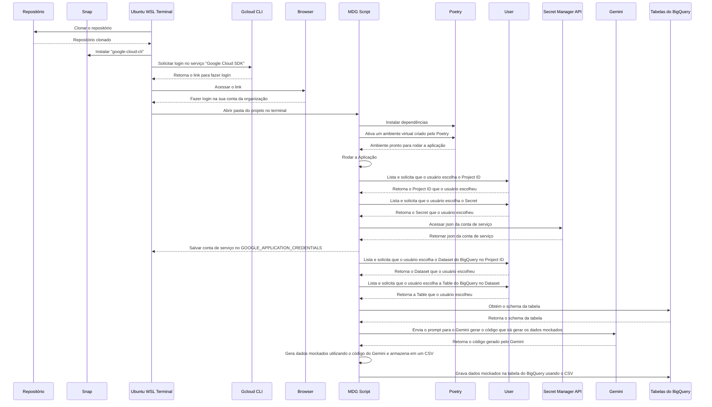

# **Diagrama de sequência**:

```mermaid
sequenceDiagram
    participant R as Repositório
    participant S as Snap
    participant T as Ubuntu WSL Terminal
    participant G as Gcloud CLI
    participant B as Browser
    participant App as MDG Script
    participant P as Poetry
    participant U as User
    participant SM as Secret Manager API
    participant GM as Gemini
    participant BQ as Tabelas do BigQuery

    T->>R: Clonar o repositório
    R-->>T: Repositório clonado

    T->>S: Instalar "google-cloud-cli"

    T->>G: Solicitar login no serviço "Google Cloud SDK"
    G-->>T: Retorna o link para fazer login
    T->>B: Acessar o link
    B-->>T: Fazer login na sua conta da organização

    T->>App: Abrir pasta do projeto no terminal

    App->>P: Instalar dependências
    App->>P: Ativa um ambiente virtual criado pelo Poetry
    P-->>App: Ambiente pronto para rodar a aplicação

    App->>App: Rodar a Aplicação

    App->>U: Lista e solicita que o usuário escolha o Project ID
    U-->>App: Retorna o Project ID que o usuário escolheu

    App->>U: Lista e solicita que o usuário escolha o Secret
    U-->>App: Retorna o Secret que o usuário escolheu

    App->>SM: Acessar json da conta de serviço
    SM-->>App: Retornar json da conta de serviço
    App-->>T: Salvar conta de serviço no GOOGLE_APPLICATION_CREDENTIALS

    App->>U: Lista e solicita que o usuário escolha o Dataset do BigQuery no Project ID
    U-->>App: Retorna o Dataset que o usuário escolheu

    App->>U: Lista e solicita que o usuário escolha a Table do BigQuery no Dataset
    U-->>App: Retorna a Table que o usuário escolheu

    App->>BQ: Obtém o schema da tabela
    BQ-->>App: Retorna o schema da tabela

    App->>GM: Envia o prompt para o Gemini gerar o código que irá gerar os dados mockados
    GM-->>App: Retorna o código gerado pelo Gemini

    App->>App: Gera dados mockados utilizando o código do Gemini e armazena em um CSV

    App->>BQ: Grava dados mockados na tabela do BigQuery usando o CSV

```

----

### [**> Voltar página.**](/README.md)